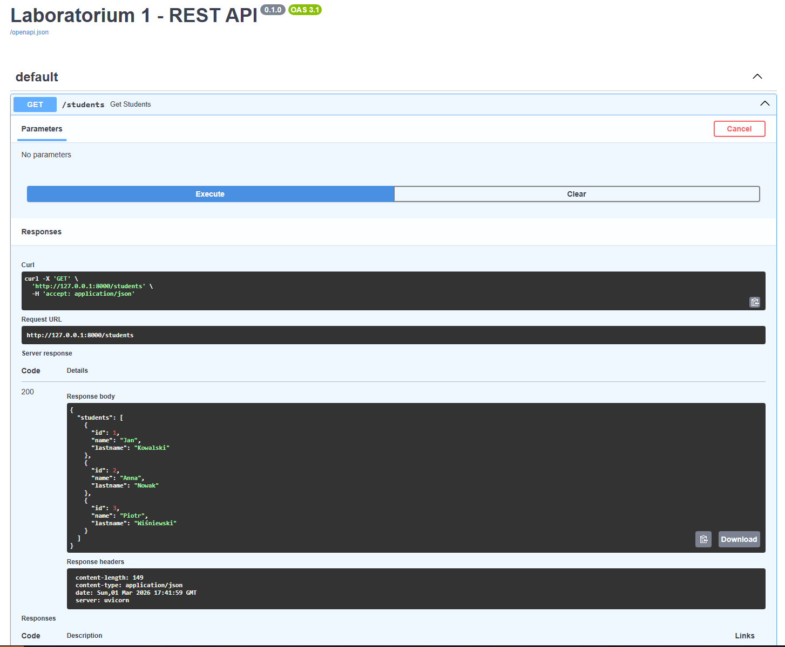
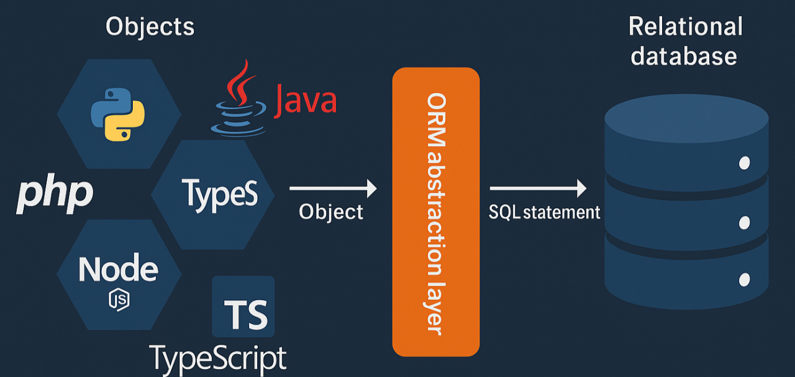
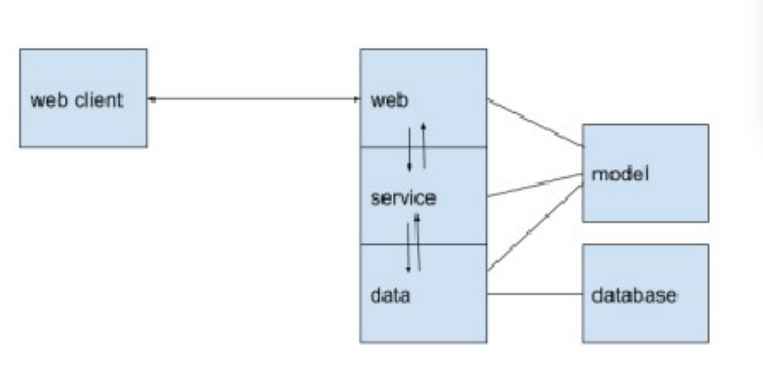

# LABORATORIUM 1
## Wprowadzenie do architektury REST, frameworka FastAPI oraz podstaw SQLAlchemy w modelu warstwowym

## 1. Wprowadzenie teoretyczne do architektury REST

Współczesne aplikacje internetowe projektowane są w przeważającej mierze w oparciu o architekturę **REST** (*Representational State Transfer*). REST nie jest technologią ani protokołem komunikacyjnym, lecz stylem architektonicznym określającym zasady projektowania systemów rozproszonych. Jego podstawowym założeniem jest orientacja na zasoby, które identyfikowane są przez unikalne adresy URL, oraz komunikacja oparta na protokole HTTP. 

Jednym z kluczowych elementów REST jest **bezstanowość** (*statelessness*). Oznacza to, że każde żądanie wysyłane przez klienta do serwera musi zawierać komplet informacji niezbędnych do jego przetworzenia. Serwer nie przechowuje informacji o poprzednich żądaniach klienta. Takie podejście upraszcza skalowanie systemu oraz zwiększa jego odporność na błędy.

Architektura REST opiera się na modelu **klient–serwer**. Klient inicjuje komunikację, natomiast serwer przetwarza żądanie i zwraca odpowiedź. Operacje wykonywane na zasobach reprezentowane są przez metody HTTP:

| Metoda | Opis |
| :--- | :--- |
| **GET** | Pobieranie danych (nie powinno zmieniać stanu serwera). |
| **POST** | Tworzenie nowego zasobu. Każde wywołanie tworzy nowy obiekt. |
| **PUT** | Pełne zastąpienie istniejącego zasobu nową wersją. |
| **PATCH** | Umożliwia częściową modyfikację (modyfikacja tylko wybranych pól zasobu) |
| **DELETE** | Usuwanie zasobu. |

Uwaga(!)<br>
Metody GET, PUT oraz DELETE są z założenia *idempotentne*. Oznacza to, że wielokrotne wykonanie identycznego żądania przyniesie taki sam skutek dla stanu serwera, jak wykonanie go tylko raz (np. wielokrotne usunięcie tego samego użytkownika nie zmieni stanu bazy danych bardziej niż pierwsze usunięcie). Metoda POST nie jest idempotentna - każde kolejne wysłanie żądania skutkuje utworzeniem kolejnego, nowego zasobu. Metoda PATCH również nie jest uznawana za idempotentną, ponieważ może służyć do operacji w których każde powtórzenie żądania zmienia stan serwera (np. przy każdym powtórzeniu instrukcji „zwiększ wiek o 1”). 

Odpowiedzi serwera opatrzone są numerycznymi kodami *statusu HTTP*, które pozwalają klientowi szybko zinterpretować wynik żądania. Klasyfikujemy je według pierwszej cyfry:
* **100s (Info):** Komunikaty informacyjne (*keep going*).
* **200s (Success):** Żądanie zostało poprawnie przetworzone.
* **300s (Redirection):** Przekierowanie - wymagane są dodatkowe akcje klienta, aby sfinalizować operację.
* **400s (Client error):** Błąd po stronie klienta (np. błędne dane wejściowe lub próba dostępu do nieistniejącego zasobu).
* **500s (Server error):** Błąd po stronie serwera.
  
Standaryzacja kodów odpowiedzi jest fundamentem interSoperacyjności systemów opartych na REST.S

## 2. Framework FastAPI – założenia i architektura


FastAPI jest nowoczesnym frameworkiem webowym przeznaczonym do budowy interfejsów API w języku Python. Framework ten został zaprojektowany w oparciu o standard **ASGI** (*Asynchronous Server Gateway Interface*), który umożliwia asynchroniczne przetwarzanie żądań HTTP.

**Architektura FastAPI wykorzystuje trzy główne komponenty:**
* **Starlette** – odpowiedzialny za obsługę warstwy HTTP oraz mechanizmów asynchronicznych.
* **Pydantic** – biblioteka do walidacji danych w oparciu o mechanizm podpowiedzi typów (*type hints*).
* **Uvicorn** – serwer ASGI umożliwiający uruchomienie aplikacji.

Jedną z najważniejszych cech FastAPI jest ścisła integracja z mechanizmem typowania języka Python. Dzięki temu framework automatycznie przeprowadza walidację danych, generuje dokumentację **OpenAPI** (dostępną pod `/docs`) oraz wykrywa niespójności typów.

### 2.1. Podstawowa aplikacja FastAPI

W celu utworzenia podstawowej aplikacji musimy posłużyć się dekoratorem, czyli zaawansowanym narzędziem w Pythonie, które pozwala na modyfikowanie funkcji lub metod bez zmieniania ich kodu źródłowego. Taki zapis w FastAPI informuje o danym endpoint

```python
#import FastAPI
from fastapi import FastAPI

app = FastAPI()

#Endpoint typu root
@app.get("/") #dekorator
def root():
    return {"message": "Welcome to the User API!"}
    
```
Uruchomienie aplikacji odbywa się przy użyciu komendy: `uvicorn main:app --reload`

### 2.3. Interaktywna Documentacja 

FastAPI automatycznie generuje interaktywną dokumentację API w postaci interfejsu Swagger. Dokumentacja ta jest dostępna pod dedykowanym adresem URL i umożliwia przeglądanie wszystkich dostępnych endpointów oraz ich testowanie bez konieczności tworzenia dodatkowego klienta.

Swagger pełni na tym etapie rolę podstawowego narzędzia do weryfikacji poprawności implementacji backendu. Pozwala on na wysyłanie żądań HTTP oraz analizę odpowiedzi w sposób wizualny i intuicyjny.

Dokumentacja jest dostępna pod poniższym adresem: 
  
http://127.0.0.1:8000/docs#/
<p align="center">
    
</p>

## 3. Podstawy ORM i rola SQLAlchemy

W podejściu obiektowym stosuje się technikę **ORM** (*Object Relational Mapping*), która umożliwia mapowanie tabel relacyjnej bazy danych na klasy języka programowania.
<p align="center">
    
</p>

* **Tabela** odpowiada klasie.
* **Kolumna** odpowiada atrybutowi klasy.
* **Rekord** odpowiada instancji klasy.

**SQLAlchemy** oferuje dwie warstwy: warstwę **Core** (budowanie zapytań SQL) oraz warstwę **ORM** (mapowanie klas na tabele). W niniejszym laboratorium koncentrujemy się na warstwie ORM.


## 4. Architektura warstwowa aplikacji


  Profesjonalne systemy informatyczne powinny być projektowane zgodnie z zasadą separacji odpowiedzialności. 
  Wyróżniamy cztery podstawowe warstwy systemu:
  * **Web** – obsługa żądań HTTP,
  * **Service** – logika biznesowa,
  * **Data** – komunikacja z bazą danych,
  * **Model** – struktury danych.

<h2>Architektura N-warstwowa – zestawienie warstw (transpozycja)</h2>

<table border="1" style="border-collapse: collapse; width: 100%;">
  <tr>
    <th>Element</th>
    <th>Web (Presentation / API Layer)</th>
    <th>Service (Business Logic Layer)</th>
    <th>Data (Data Access Layer)</th>
    <th>Model (Shared Data Structures)</th>
  </tr>

  <tr>
    <td><strong>Rola ogólna</strong></td>
    <td>Warstwa komunikacji HTTP między klientem a systemem</td>
    <td>Warstwa logiki biznesowej aplikacji</td>
    <td>Warstwa dostępu do źródeł danych</td>
    <td>Wspólne definicje struktur danych wykorzystywane między warstwami</td>
  </tr>

  <tr>
    <td><strong>Główne odpowiedzialności</strong></td>
    <td>
      Odbieranie żądań HTTP (GET, POST, PUT, DELETE)<br>
      Mapowanie endpointów<br>
      Walidacja danych wejściowych<br>
      Serializacja i deserializacja (JSON ↔ obiekty)<br>
      Zwracanie odpowiedzi HTTP (status code + body)
    </td>
    <td>
      Implementacja reguł biznesowych<br>
      Walidacje domenowe<br>
      Przetwarzanie danych<br>
      Koordynacja operacji między warstwami<br>
      Wywoływanie warstwy data
    </td>
    <td>
      Komunikacja z bazą danych<br>
      Wykonywanie zapytań SQL<br>
      Operacje CRUD<br>
      Integracja z ORM<br>
      Dostęp do zewnętrznych usług
    </td>
    <td>
      Definicja struktur danych<br>
      Walidacja danych (np. Pydantic)<br>
      Reprezentacja obiektów domenowych<br>
      DTO (Data Transfer Objects)
    </td>
  </tr>
</table>

<p align="center">
    
</p>

## 5. Implementacja REST z wykorzystaniem wzorca N-layers


### 5.1. Struktura projektu
```text
REST/
│
├── main.py
│
├── web/
│   └── routes.py
│
├── service/
│   └── student_service.py
│
├── data/
│   ├── database.py
│   └── student_repository.py
│
└── model/
    ├── student_schema.py
    └── student_orm.py
```

### 5.2. Warstwa Model
Wykorzystuje klasę BaseModel z biblioteki Pydantic do walidacji danych.


```python
# model/student_orm.py
from sqlalchemy.orm import Mapped, mapped_column
from sqlalchemy import Integer, String

from data.database import Base


class StudentORM(Base):
    __tablename__ = "students"

    id: Mapped[int] = mapped_column(Integer, primary_key=True)
    name: Mapped[str] = mapped_column(String)
    lastname: Mapped[str] = mapped_column(String)
```
```python
# model/student_schema.py
from pydantic import BaseModel


class Student(BaseModel):
    id: int
    name: str
    lastname: str

    class Config:
        from_attributes = True
```

### 5.3. Warstwa Data
Odpowiada za konfigurację połączenia z bazą danych oraz operacje SQL.


```python
# data/database.py
import os
from sqlalchemy import create_engine
from sqlalchemy.orm import DeclarativeBase, sessionmaker

DB_HOST = os.getenv("DB_HOST", "localhost")
DB_PORT = int(os.getenv("DB_PORT", "5432"))
DB_NAME = os.getenv("DB_NAME", "appdb")
DB_USER = os.getenv("DB_USER", "appuser")
DB_PASSWORD = os.getenv("DB_PASSWORD", "apppassword")

DATABASE_URL = (
    f"postgresql+psycopg://{DB_USER}:{DB_PASSWORD}"
    f"@{DB_HOST}:{DB_PORT}/{DB_NAME}"
)

engine = create_engine(
    DATABASE_URL,
    echo=True
)


# ORM BASE
class Base(DeclarativeBase):
    pass


# SESSION FACTORY
SessionLocal = sessionmaker(
    bind=engine,
    autoflush=False,
    autocommit=False
)

# FASTAPI DEPENDENCY
def get_db():
    db = SessionLocal()
    try:
        yield db
    finally:
        db.close()
```


```python
# data/student_repository.py
from sqlalchemy.orm import Session
from sqlalchemy import select

from model.student_orm import StudentORM
from data.database import Base, engine


def create_tables():
    Base.metadata.create_all(engine)


def get_all_students(db: Session):
    query = select(StudentORM)
    result = db.execute(query)
    return result.scalars().all()
```


### 5.4. Warstwa Service
Zawiera logikę biznesową i pośredniczy pomiędzy warstwą Web a Data.


```python
# service/student_service.py
from sqlalchemy.orm import Session
from data.student_repository import get_all_students


def list_students(db: Session):
    return get_all_students(db)
```


### 5.5. Warstwa Web
Odpowiada za obsługę żądań HTTP oraz mapowanie metod na operacje systemowe.


```python
# web/routes.py
from fastapi import APIRouter, Depends
from sqlalchemy.orm import Session

from service.student_service import list_students
from data.database import get_db
from model.student_schema import Student

router = APIRouter()

@router.get("/students", response_model=list[Student])
def get_students(db: Session = Depends(get_db)):
    return list_students(db)
```


### 5.6. Plik główny aplikacji


```python
# main.py
from fastapi import FastAPI
from REST.web.routes import router

app = FastAPI()
app.include_router(router)
```


## 6. Zadanie do wykonania na laboratorium
Uruchom program przestawiający standardową warstwową architekture REST w katalogu ./REST. Wykonaj poniższe kroki:

1. Aktywuj środowisko wirtualne

`python -m venv venv`  

`venv\Scripts\activate` 

`pip install -r requirements.txt`

1. Uruchom dockera i zbuduj kontener

`docker compose up -d --build`  

3. Uruchom FastApi

`uvicorn main:app --reload`


## Etap 1. Projekt 1.
1. Utwórz własny projekt w VSC 
2. Na podstawie laboratorium wprowadzającego ('review_python.ipynb') nawiąż połączenie z bazą danych typu postgres. Baza powinna się znajdować jako kontener Dockera
3. Utwórz bazę danych zawierające produkty wraz z ich kategoriami oraz cenami
4. Zaimplementuj architekture REST, tak by pod następującymi endpointami pojawiły się następujące wyniki:
   • `GET /api/v1/products` - lista wszystkich produktów 
   • `GET /api/v1/products/{id}` - lista produktów o danym ID

Na kolejnych zajęciach będzie trzeba pokazać:
- bazę danych
- wytłumaczyć poszczególne elementy zaimplementowanej architektury REST
- pokazać działające endpointy w dokumentacji http://127.0.0.1:8000/docs#/
      
   

