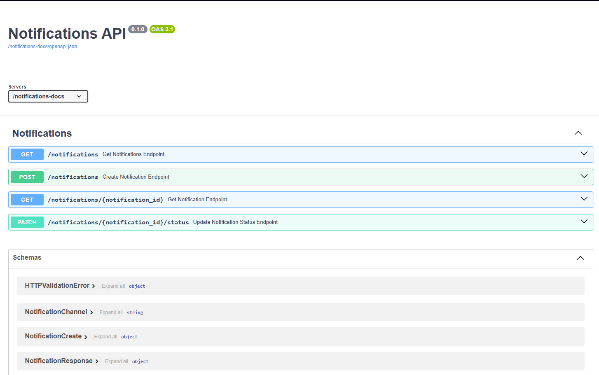

# Laboratorium 4 – moduł `notifications`
Celem laboratorium 4 jest rozbudowanie systemu o mechanizmy planowania wysyłki powiadomień oraz podstawowy model ich cyklu życia.

Po zakończeniu laboratorium aplikacja powinna umożliwiać:

- utworzenie powiadomienia,
- zapisanie treści, kanału i odbiorcy,
- wskazanie planowanego momentu wysyłki,
- zapisanie strefy czasowej,
- trwałe przechowywanie powiadomień w bazie danych,
- nadanie powiadomieniu statusu początkowego,
- przygotowanie systemu pod dalszą obsługę przejść stanów.

## 1. Struktura projektu

W tym laboratorium wprowadzamy nowy moduł odpowiedzialny za planowanie i obsługę powiadomień. Moduł ten nie powinien znajdować się wewnątrz katalogu `REST`, lecz **obok niego**, na tym samym poziomie w katalogu `app`.

Dzięki temu zachowujemy wyraźny podział między wcześniejszym modułem REST a nowym, osobnym obszarem funkcjonalnym aplikacji.
Taka struktura oznacza, że moduł `notifications` staje się osobnym komponentem aplikacji, posiadającym własne modele, własną logikę biznesową, własną warstwę dostępu do danych oraz własne endpointy.


Omawiana struktura katalogów będzie wyglądać następująco:


```
app/
├── REST/
├── notifications/
│   ├── data/
│   ├── model/
│   ├── service/
│   └── web/
├── db/
│   └── init/
```
## 2. Integracja modułu z interaktywną dokumentacją
Istniejąca dokumentacja zawiera wszystkie endpointy obecne w projekcie. By zachować spójną strukturę, należy dodać w plikach warstwy webowej - routes.py tagi pozwalające na wyświetlanie dokumentacji w danych sekcjach
```python
#app/notifications/web/routes.py
    router = APIRouter(tags=["Notifications"])
```
Dodatkowo, aby umożliwić wyświetlanie dokumentacji danego modułu - w naszym przypadku notifications, należy dodać plik z dodatkowymi ustawieniami dokumentacji.
```python
#app/notifications/docs_app.py
from app.notifications.web.routes import router as notifications_router

notifications_docs_app = FastAPI(
    title="Notifications API",
    docs_url="/",
    redoc_url=None,
    openapi_url="/openapi.json"
)

notifications_docs_app.include_router(notifications_router)
```

```python
#main.py
app = FastAPI(title="Laboratorium 4 - Powiadomienia")

app.include_router(students_router, prefix="/api/v1")
app.include_router(notifications_router, prefix="/api/v1")

#Dokumentacja tylko dla powiadomień
app.mount("/student-docs", student_docs_app)
app.mount("/notifications-docs", notifications_docs_app)

if __name__ == "__main__":
    import uvicorn
    uvicorn.run("app.main:app", host="127.0.0.1", port=8000, reload=True)
```
Dokumentacje zawierającą informację tylko o powiadomieniach można znaleźć pod adresem http://127.0.0.1:8000/notifications-docs/



## 3. Implementacja modułu planowania i obsługi powiadomień 
Do implementacji powiadomień powinniśmy się posłużyć wcześniej poznanym modelem architektonicznym REST. Szczegółowy opis metod wykorzystywanych w REST API znajduje się w `Laboratorium 2`, które można znaleźć pod ścieżką `_docs\Lab2_instruction.md`. 

W dzisiejszym laboratorium przypomnimy sobie architekturę REST oraz poszerzymy ją o :implementacje danych czasowych oraz związanej z nią walidacją, a także o maszynę stanów.

## Model cyklu życia powiadomienia – maszyna stanów

W systemach przetwarzających operacje w czasie istotne jest nie tylko przechowywanie danych, ale również kontrola ich ewolucji. W przypadku powiadomień oznacza to konieczność zarządzania ich stanem oraz określenia dozwolonych przejść pomiędzy poszczególnymi etapami cyklu życia.

W tym celu wprowadzono uproszczoną maszynę stanów, która definiuje dopuszczalne zmiany statusu powiadomienia.

Zdefiniowany model zakłada, że:
- powiadomienie w stanie PENDING (oczekujące) może:
    - zostać wysłane (`SENT`)
    - zakończyć się niepowodzeniem (`FAILED`)
    - zostać anulowane (`CANCELLED`)
- stany `SENT`, `FAILED` oraz `CANCELLED` są traktowane jako stany końcowe, co oznacza, że **nie dopuszcza się** dalszych przejść z tych stanów.

```python
#app/notifications/service/notification_state_machine.py
ALLOWED_TRANSITIONS = {
    NotificationStatus.PENDING: {
        NotificationStatus.SENT,
        NotificationStatus.FAILED,
        NotificationStatus.CANCELLED,
    },
    NotificationStatus.SENT: set(),
    NotificationStatus.FAILED: set(),
    NotificationStatus.CANCELLED: set(),
}
def can_transition(current_status: NotificationStatus, new_status: NotificationStatus) -> bool:
 """"Funkcja przyjmuje aktualny stan powiadomienia oraz stan docelowy,
    sprawdza, czy przejście jest dozwolone zgodnie z definicją maszyny stanów,
    zwraca wartość logiczną (True lub False)."""
    return new_status in ALLOWED_TRANSITIONS.get(current_status, set())

```

```python
#app/notifications/model/notification_status.py

class NotificationStatus(str, Enum):
    PENDING = "PENDING"             #powiadomienie oczekujące
    SENT = "SENT"                   #powiadomienie wysłane
    FAILED = "FAILED"               #powiadomienie nieudane
    CANCELLED = "CANCELLED"         #powiadomienie anulowane
```

### Model kanałów komunikacji
W systemie powiadomień istotnym elementem modelu domenowego jest określenie sposobu dostarczenia wiadomości do odbiorcy. W tym celu wprowadzono model kanałów komunikacji, reprezentowany przez klasę NotificationChannel. 

Model NotificationChannel definiuje zbiór dopuszczalnych kanałów, za pomocą których powiadomienia mogą być dostarczane. Na potrzeby obecnego etapu implementacji przyjęto dwa podstawowe kanały:
- EMAIL – komunikacja za pośrednictwem poczty elektronicznej,
- PUSH – komunikaty wysyłane bezpośrednio do aplikacji użytkownika.
```python
#app/notifications/model/notification_channel.py
class NotificationChannel(str, Enum):
    EMAIL = "EMAIL"
    PUSH = "PUSH"
``` 
## REST API – obsługa danych czasowych w module notifications

W przeciwieństwie do wcześniejszych laboratoriów, w których główny nacisk był położony na operacje CRUD oraz podstawowy przepływ danych pomiędzy klientem, warstwą serwisową i bazą danych, w Laboratorium 4 kluczowym elementem implementacji staje się obsługa zmiennych czasowych.

Sam sposób budowy endpointów REST pozostaje zgodny z wcześniej przyjętym modelem architektonicznym. Nadal wykorzystujemy:
- warstwę `web` do obsługi żądań HTTP,
- warstwę `service` do logiki biznesowej,
- warstwę `repository` do komunikacji z bazą danych.

Nowym elementem jest jednak konieczność poprawnego przyjmowania, interpretowania, walidowania oraz przechowywania informacji o czasie planowanej wysyłki.

### Dane czasowe w żądaniu HTTP

Podczas tworzenia nowego powiadomienia klient przekazuje do systemu między innymi dwa pola związane z czasem:
- `scheduled_at` – planowany moment wysyłki,
- `timezone` – strefę czasową, w której należy interpretować przekazaną datę i godzinę.

Przykładowe żądanie może wyglądać następująco:
```JSON
{
  "content": "Przypomnienie o zajęciach",
  "channel": "EMAIL",
  "recipient": "student@example.com",
  "scheduled_at": "2026-04-15T09:00:00",
  "timezone": "Europe/Warsaw"
}
```
Warto zauważyć, że sama wartość `scheduled_at` nie jest wystarczająca do jednoznacznej interpretacji momentu wysyłki. Ta sama godzina może bowiem oznaczać różne rzeczy w zależności od strefy czasowej. Dlatego dopiero połączenie pól scheduled_at oraz timezone pozwala określić właściwy moment w czasie.

### Schemat danych wejściowych

W warstwie REST dane wejściowe są opisywane przez schemat Pydantic:
```python
class NotificationCreate(BaseModel):
    content: str
    channel: NotificationChannel
    recipient: str
    scheduled_at: datetime
    timezone: str
```
Wprowadzenie pola scheduled_at typu datetime oznacza, że API oczekuje wartości reprezentującej datę i godzinę, natomiast pole timezone przechowuje nazwę strefy czasowej przekazaną przez klienta.

Na poziomie REST API oznacza to, że endpoint przyjmuje już nie tylko dane tekstowe lub identyfikatory, ale również informacje opisujące moment planowanego wykonania operacji.

### Znaczenie strefy czasowej

W systemach obsługujących zdarzenia planowane w czasie bardzo istotne jest rozróżnienie pomiędzy:
lokalnym czasem użytkownika, a czasem przechowywanym wewnętrznie przez system.

Użytkownik podaje datę w kontekście własnej strefy czasowej, np. Europe/Warsaw. Jednak system nie powinien opierać dalszego przetwarzania na wielu lokalnych strefach jednocześnie, ponieważ utrudnia to porównywanie dat oraz budowę logiki planowania.

Z tego powodu wprowadzono mechanizm konwersji czasu do UTC, który stanowi wspólny punkt odniesienia dla całej aplikacji.

### Walidacja danych czasowych

Obsługa czasu w REST API nie ogranicza się wyłącznie do odebrania wartości z żądania. Konieczne jest również sprawdzenie ich poprawności.

W warstwie walidacji wykonywane są następujące operacje:
- sprawdzenie, czy strefa czasowa została podana
- weryfikacja, czy nazwa strefy czasowej jest poprawna
- interpretacja daty scheduled_at w kontekście wskazanej strefy
- sprawdzenie, czy planowana data wskazuje moment przyszły

```python
#app/notifications/service/notification_validators.py

def validate_timezone(timezone_name: str):
    if not timezone_name or not timezone_name.strip():
        raise ValueError("Strefa czasowa jest wymagana.")

    try:
        ZoneInfo(timezone_name)
    except ZoneInfoNotFoundError as exc:
        raise ValueError("Podana strefa czasowa jest nieprawidłowa.") from exc


def convert_to_utc(scheduled_at: datetime, timezone_name: str) -> datetime:
    """
    Przyjmuje datę planowanej wysyłki oraz nazwę strefy czasowej.
    Zwraca datę przekonwertowaną do UTC.
    """
    zone = ZoneInfo(timezone_name)

    # Jeżeli użytkownik podał czas bez strefy, traktujemy go jako czas lokalny
    # w strefie wskazanej w polu timezone.
    if scheduled_at.tzinfo is None:
        local_dt = scheduled_at.replace(tzinfo=zone)
    else:
        local_dt = scheduled_at.astimezone(zone)

    return local_dt.astimezone(timezone.utc)


def validate_scheduled_at(scheduled_at: datetime, timezone_name: str):
    scheduled_at_utc = convert_to_utc(scheduled_at, timezone_name)

    if scheduled_at_utc <= datetime.now(timezone.utc):
        raise ValueError("Planowana data wysyłki musi wskazywać przyszły moment.")
```

Z punktu widzenia REST API oznacza to, że endpoint nie tylko przyjmuje dane, ale również egzekwuje reguły poprawności związane z planowaniem w czasie.

### Konwersja czasu do UTC

Najważniejszym etapem obsługi zmiennych czasowych jest ich normalizacja do wspólnego formatu wewnętrznego. W naszym przypadku rolę tę pełni UTC.
```python
def convert_to_utc(scheduled_at: datetime, timezone_name: str) -> datetime:
    zone = ZoneInfo(timezone_name)                      #odczyt nazwy strefy czasowej

    if scheduled_at.tzinfo is None:
        local_dt = scheduled_at.replace(tzinfo=zone)    #interpretacja scheduled_at jako czasu lokalnego
    else:
        local_dt = scheduled_at.astimezone(zone)

    return local_dt.astimezone(timezone.utc)            # przeliczenie czasu na UTC
```

### Rola warstwy service

Właściwa logika obsługi czasu nie powinna znajdować się bezpośrednio w endpointzie. Endpoint REST pełni rolę wejścia do systemu, natomiast interpretacja czasu, jego walidacja oraz konwersja do UTC są realizowane w warstwie service.
```python
def create_notification(db: Session, notification_data: NotificationCreate) -> NotificationORM:
    #walidacja
    validate_content(notification_data.content)
    validate_recipient(notification_data.recipient)
    validate_timezone(notification_data.timezone)
    validate_scheduled_at(notification_data.scheduled_at, notification_data.timezone)

    #konwercja czasu lokalnego na UTC
    scheduled_at_utc = convert_to_utc(
        notification_data.scheduled_at,
        notification_data.timezone,
    )

    #utworzenie obiektu powiadomienia
    notification = NotificationORM(
        content=notification_data.content,
        channel=notification_data.channel.value,
        recipient=notification_data.recipient,
        scheduled_at=scheduled_at_utc,
        timezone=notification_data.timezone,
        status=NotificationStatus.PENDING.value,
    )

    #dodanie obiektu w repozytorium
    return add_notification(db, notification)
```

Po przejściu przez walidację i konwersję czas planowanej wysyłki trafia do modelu ORM i zostaje zapisany w bazie danych.

W warstwie modelu pole to reprezentowane jest jako:
```python
scheduled_at: Mapped[datetime] = mapped_column(DateTime, nullable=False)
```
Natomiast w warstwie SQL odpowiada mu kolumna:
```sql
scheduled_at TIMESTAMP NOT NULL
```
Z punktu widzenia logiki systemu oznacza to, że baza przechowuje już znormalizowany moment planowanej wysyłki, który może być później wykorzystany przez przyszły mechanizm schedulera lub workera.


## Zadanie do wykonania na laboratorium

W ramach laboratorium należy uruchomić projekt, sprawdzić działanie aplikacji po wprowadzonych zmianach, a następnie zweryfikować poprawność działania testów.

Wykonaj poniższe kroki:

1. Aktywuj środowisko wirtualne 

    `python -m venv .venv`

    `.venv\Scripts\activate`

    Po aktywacji zainstaluj wymagane zależności:<br>
    `pip install -r .\requirements.txt`

2. Uruchom kontenery projektu za pomocą polecenia:<br>
    `docker compose up -d --build`

3. Uruchom aplikację poleceniem:<br>
    `uvicorn main:app --reload`

4. Weryfikacja działania endpointów<br>
    Przetestuj dostępne endpointy aplikacji. Zwróć uwagę na zapis powiadomienia w bazie danych. 
5. Przejdź pod podrzędne dokumentacje:

    http://127.0.0.1:8000/notifications-docs/

    http://127.0.0.1:8000/student-docs/
## Projekt 2. Etap 1.
- Utworzenie maszyny stanów dla powiadomień dot. produktów (statusy: Oczekujące/Wysłane/Nieudane/Anulowane)
- REST API dla powiadomień, z uwzględnieniem czasu UTC
- Interaktywna dokumentacja z podziałem na podstrony - osobna dokumentacja dla produktów i powiadomień 