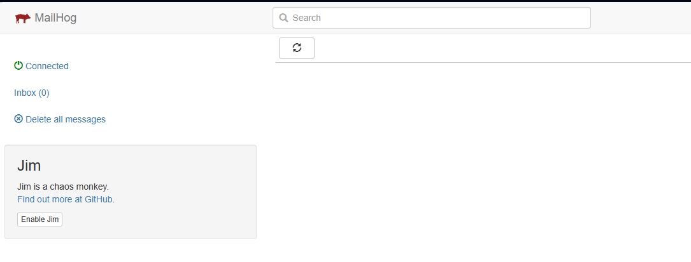
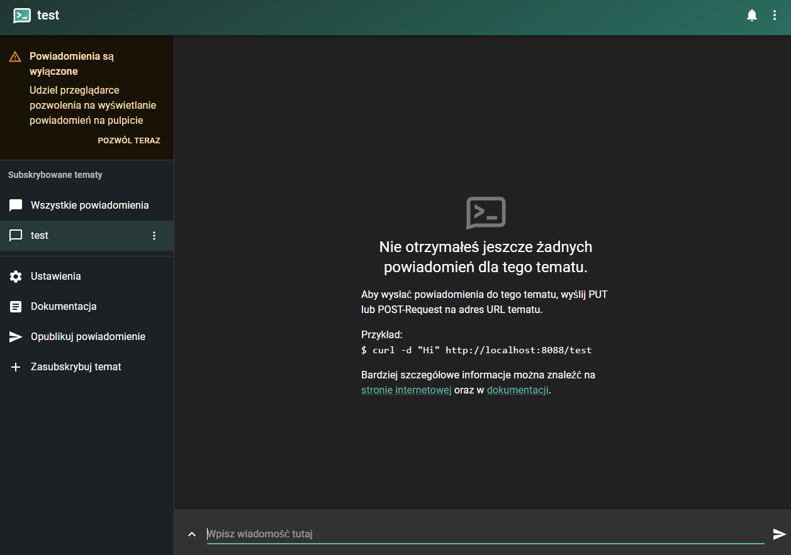
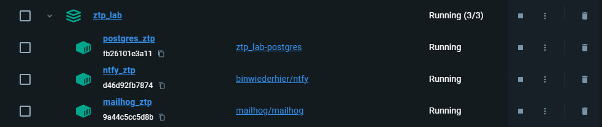
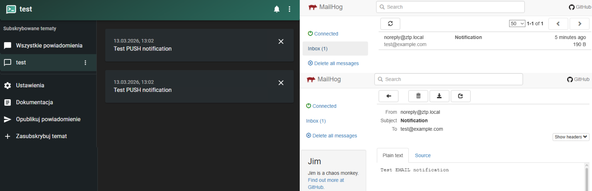

# Laboratorium  5
W poprzednim laboratorium system został rozszerzony o możliwość definiowania oraz planowania powiadomień. Wprowadzono model domenowy, walidację danych, obsługę stref czasowych oraz trwałe przechowywanie informacji w bazie danych.

Celem Laboratorium 5 jest rozszerzenie systemu o mechanizm realizacji zaplanowanych operacji. Oznacza to przejście od modelu, w którym powiadomienia są jedynie przechowywane, do modelu, w którym są one aktywnie przetwarzane.

W celu zachowania spójności z architekturą warstwową, mechanizm realizacji został podzielony na trzy komponenty:
```python
service/
├── notification_delivery_service.py # Odpowiada za wykonanie operacji (np. wysyłkę wiadomości)
├── notification_dispatcher.py  #decyzja, który kanał komunikacji należy wykorzystać
├── notification_worker.py  #pobranie danych z bazy, uruchomienie procesu realizacji.
```
`Warstwa delivery` - Komponent notification_delivery_service.py odpowiada za bezpośrednie wykonanie operacji wysyłki. W wersji rozszerzonej wykorzystano dwa narzędzia uruchamiane lokalnie w Dockerze:
- MailHog – do przechwytywania wiadomości e-mail,
- ntfy – do testowania powiadomień typu push.

Dzięki temu możliwe jest wykonanie pełnego scenariusza testowego bez użycia zewnętrznych, produkcyjnych usług.

`Dispatcher` - notification_dispatcher.py pełni rolę pośrednika pomiędzy logiką biznesową a warstwą techniczną realizacji. Na podstawie wartości pola channel wybiera właściwy mechanizm wykonania.

`Worker` - notification_worker.py odpowiada za pobieranie rekordów gotowych do realizacji i ich przetwarzanie. Worker jest uruchamiany cyklicznie co określony interwał czasowy, np. co 5 sekund.

## Kanały powiadomień
### Mailhog
MailHog to narzędzie programistyczne open source służące do emulacji serwera protokołu SMTP (Simple Mail Transfer Protocol). Z perspektywy architektury systemów, pełni ono rolę „czarnej dziury” dla wychodzącej korespondencji elektronicznej w środowiskach izolowanych (lokalnych lub stagingowych).

Kluczowe cechy i zasada działania:
- Przechwytywanie (Email Catching): MailHog implementuje protokół SMTP, dzięki czemu aplikacje mogą wysyłać do niego wiadomości, konfigurując jedynie adres localhost i odpowiedni port. Narzędzie przesyła wiadomości do wewnętrznej bazy danych w pamięci RAM, zamiast przekazywać je do rzeczywistych serwerów MX (Mail Exchange).

- Inspekcja poprzez API i GUI: Narzędzie udostępnia interfejs webowy (Web UI) oraz API RESTowe, co pozwala programistom na weryfikację struktury wiadomości (nagłówki, MIME, załączniki) bez ryzyka wysłania testowych danych do realnych użytkowników.

- Chaos Engineering: MailHog posiada funkcję „Jim”, która pozwala na symulowanie awarii sieciowych i opóźnień, co jest kluczowe w testowaniu odporności systemów na błędy komunikacji asynchronicznej.

link: http://localhost:8025

<p align="center">
    
</p>

### Ntfy.sh
Ntfy (wymawiane jako notify) to lekki system publikacji open source i subskrypcji (Pub/Sub) oparty na protokole HTTP, zaprojektowany do przesyłania powiadomień typu push na urządzenia.

Charakterystyka techniczna:
- Paradygmat komunikacji: ntfy.sh wykorzystuje model bezstanowy z perspektywy nadawcy. Wysyłanie powiadomienia sprowadza się do wykonania żądania metodą POST lub PUT na unikalny zasób (tzw. topic).

- Mechanizm dostarczania: Po stronie odbiorcy (np. aplikacji mobilnej), narzędzie wykorzystuje technologie WebSockets lub Server-Sent Events (SSE), aby utrzymać stałe połączenie i zapewnić minimalne opóźnienia w dostarczaniu komunikatów (latencję).

- Agnostyczność technologiczna: Ze względu na oparcie o czysty protokół HTTP, ntfy.sh jest niezależne od języka programowania i platformy, co czyni go idealnym rozwiązaniem do monitorowania długotrwałych procesów obliczeniowych, skryptów automatyzacji oraz systemów IoT (Internet of Things).


link: http://localhost:8088/test
<p align="center">
    
</p>

### Realizacja kanałów komunikacji
Plik `notification_dispatrcher.py` odpowiada za wybór odpowiedniego kanału komunikacji: email lub powiadomienia PUSH na telefon. Wybór odbywa się za pomoca określonego kanału komunikacji w bazie danych.

```python
#app/notifications/service/notification_dispatrcher.py
def dispatch_notification(notification: NotificationORM) -> None:
    """
    Wybiera właściwy mechanizm wysyłki na podstawie kanału komunikacji.
    """
    channel = NotificationChannel(notification.channel)

    if channel == NotificationChannel.EMAIL:
        send_email_notification(notification)
        return

    if channel == NotificationChannel.PUSH:
        send_push_notification(notification)
        return

    raise ValueError(f"Nieobsługiwany kanał powiadomienia: {notification.channel}")
```

### Kanał e-mail
Dla kanału EMAIL system korzysta z lokalnego SMTP udostępnianego przez MailHog. Wysłana wiadomość nie trafia do rzeczywistej skrzynki odbiorcy, lecz jest przechwytywana i prezentowana w interfejsie webowym MailHog.

```python
#app/notifications/service/notification_delivery_service.py
def send_email_notification(notification: NotificationORM) -> None:
    msg = EmailMessage()
    msg.set_content(notification.content)
    msg["Subject"] = "Notification"
    msg["From"] = "noreply@ztp.local"
    msg["To"] = notification.recipient

    with smtplib.SMTP("localhost", 1025) as server:
        server.send_message(msg)
```

### Kanał PUSH
Dla kanału PUSH system wykorzystuje lokalny serwer ntfy. Pole recipient interpretowane jest jako nazwa topicu, pod który należy wysłać powiadomienie.

```python
#app/notifications/service/notification_delivery_service.py
def send_push_notification(notification: NotificationORM) -> None:
    response = requests.post(
        f"http://localhost:8088/{notification.recipient}",
        data=notification.content.encode("utf-8"),
        timeout=5,
    )
response.raise_for_status()
```
### Instalacja kontenerów
W celu instalacji serwerów Mailhog oraz Ntfy.sh musimy dodać do naszego pliku `docker-compose.yml` następujący fragment kodu umożliwiający inicjalizacje odpowiednich kontenerów.

```docker
# testowanie powiadomień
  mailhog:
    image: mailhog/mailhog
    container_name: mailhog_ztp
    ports:
      - "8025:8025"   # UI
      - "1025:1025"   # SMTP

  ntfy:
    image: binwiederhier/ntfy
    container_name: ntfy_ztp
    command: serve
    ports:
      - "8088:80"
```
Po uruchomieniu programu docker komendą `docker compose up -d`, powinniśmy zobaczyć 3 uruchomione kontenery w projekcie
<p align="center">
    
</p>

### Worker cykliczny
Worker uruchamia się  w pętli nieskończonej, co określoną liczbę sekund. W tym czasie wykonuje następujące kroki:
1. otwiera sesję połączenia z bazą danych,
2. pobiera powiadomienia o statusie PENDING, których czas scheduled_at jest mniejszy lub równy bieżącemu czasowi UTC,
3. wywołuje wykonanie każdego z takich rekordów,
4. zapisuje wynik przetwarzania,
5. zamyka sesję bazy danych,
6. przechodzi w stan uśpienia na określony interwał czasowy.

Takie rozwiązanie stanowi uproszczoną formę schedulera, tym samym pozwala na pokazanie podstawowego modelu przetwarzania cyklicznego.

```python
#app/notifications/service/notifications_worker.py

def process_ready_notifications(db: Session) -> int:

    #Pobiera wszystkie powiadomienia gotowe do realizacji
    notifications = get_ready_notifications(db)

    #Wysyłanie powiadomień
    for notification in notifications:
        execute_notification(db, notification.id)

    return len(notifications)


def run_worker(interval_seconds: int = 5) -> None:
    print(f"[WORKER] Uruchomiono worker. Interwał: {interval_seconds} s")

    while True:        
        #nawiązanie połączenia z bazą danych
        db = SessionLocal()
        try:
            processed = process_ready_notifications(db)
            if processed:
                print(f"[WORKER] Przetworzono {processed} powiadomień.")
        except Exception as exc:
            print(f"[WORKER] Wystąpił błąd: {exc}")
        finally:
            db.close()

        #uśpienie na określony czas
        time.sleep(interval_seconds)

```
Worker został uruchomiony automatycznie razem z aplikacją FastAPI jako wątek działający w tle. Dzięki temu powiadomienia są przetwarzane cyklicznie bez potrzeby uruchamiania osobnego procesu.

```python
#main.py
from contextlib import asynccontextmanager
from threading import Thread
from app.notifications.service.notification_worker import run_worker

@asynccontextmanager
async def lifespan(app: FastAPI):
    thread = Thread(target=run_worker, daemon=True)
    thread.start()
    yield

app = FastAPI(
    title="Laboratorium 4 - Powiadomienia",
    lifespan=lifespan,
)
```

## Dodanie funkcjonalności w istniejących plikach

### Rozszerzenie repozytorium
W warstwie dostępu do danych dodano funkcję `get_ready_notifications()`, której zadaniem jest pobieranie powiadomień spełniających warunki gotowości do realizacji.

Funkcja ta stanowi podstawę działania workera oraz wsadowego przetwarzania rekordów.

`Wsadowe przetwarzanie` rekordów (ang. batch processing) to metoda wykonywania dużej liczby zadań lub przetwarzania ogromnych zbiorów danych w grupach (wsadach), bez konieczności interakcji z użytkownikiem w trakcie trwania procesu.

Zamiast zajmować się każdym rekordem z osobna w momencie jego pojawienia się, system zbiera je, a następnie przetwarza wszystkie naraz w określonym czasie (np. raz na dobę, gdy obciążenie serwerów jest najmniejsze).
```python
#app/notifications/data/notification_repository.py
def get_ready_notifications(db: Session) -> list[NotificationORM]:
    now_utc = datetime.now(timezone.utc)

    return (
        db.query(NotificationORM)
        .filter(NotificationORM.status == NotificationStatus.PENDING.value)
        .filter(NotificationORM.scheduled_at <= now_utc)
        .order_by(NotificationORM.scheduled_at.asc())
        .all()
    )
```

### Rozszerzenie warstwy service
W warstwie `notification_service.py` dodano funkcję `execute_notification()`, odpowiedzialną za realizację pojedynczego rekordu.

```python
def execute_notification(db: Session, notification_id: int) -> NotificationORM:

    #pobranie rekordu
    notification = get_notification_or_raise(db, notification_id)
    
    #sprawdzenie statusu powiadomienia
    current_status = NotificationStatus(notification.status)

    if current_status != NotificationStatus.PENDING:
        raise ValueError("Wykonać można wyłącznie powiadomienie w statusie PENDING.")

    try:
        #uruchomienie właściwego kanału wykonania
        dispatch_notification(notification)

        #aktualizacja statusu powiadomienia
        notification.status = NotificationStatus.SENT.value
    except Exception:
        notification.status = NotificationStatus.FAILED.value

    #zapis statusu do bazy danych
    return save_notification(db, notification)
```

Kroki działającego programu w tej funkcji:
1. pobiera rekord z bazy danych,
2. sprawdza, czy jego status wynosi PENDING,
3. uruchamia dispatcher,
4. w przypadku powodzenia ustawia status SENT,
5. w przypadku błędu ustawia status FAILED,
6. zapisuje zaktualizowany rekord w bazie danych.

### Rozszerzenie API - dodanie pomocniczych endpointów
Dodane endpointy pozwalają na testowanie wcześniej wymienionych funkcjonalności:

- POST `/notifications/{notification_id}/send-now` - Endpoint wymusza wykonanie pojedynczego powiadomienia od razu, niezależnie od zaplanowanej daty wysłania.

- POST `/notifications/process-ready`
Endpoint uruchamia przetwarzanie wsadowe wszystkich rekordów gotowych do realizacji.

```python
#app/notifications/web/routes.py 

@router.post(
    "/notifications/{notification_id}/send-now",
    response_model=NotificationResponse,
    status_code=status.HTTP_200_OK,
)
def send_notification_now_endpoint(
    notification_id: int,
    db: Session = Depends(get_db),
):
    try:
        return execute_notification(db, notification_id)
    except LookupError as exc:
        raise HTTPException(
            status_code=status.HTTP_404_NOT_FOUND,
            detail=str(exc),
        ) from exc
    except ValueError as exc:
        raise HTTPException(
            status_code=status.HTTP_422_UNPROCESSABLE_CONTENT,
            detail=str(exc),
        ) from exc


@router.post(
    "/notifications/process-ready",
    status_code=status.HTTP_200_OK,
)
def process_ready_notifications_endpoint(db: Session = Depends(get_db)):
    processed = process_ready_notifications(db)
    return {"processed_count": processed}
```

## Zadania do wykonania na laboratorium
1. Aktywuj środowisko wirtualne 

    `python -m venv .venv`

    `.venv\Scripts\activate`

    Po aktywacji zainstaluj wymagane zależności:<br>
    `pip install -r .\requirements.txt`

2. Uruchom kontenery projektu za pomocą polecenia:<br>
    `docker compose up -d --build`


3. Test serwera nfty<br>
- Wejdź na stronę http://localhost:8088/test


4. Test serwera mailhog
- Wejdź na stronę http://localhost:8025/ 

5. Wykonaj testy i sprawdź czy w obu serwerach otrzymane zostały powiadomienia testowe

    `python -m pytest .\tests\test_notifications.py`
<p align="center">
    
</p>

6. Uruchom aplikację poleceniem:<br>
    `uvicorn main:app --reload`

7. Przetestuj planowanie powiadomień
    Ustaw czas realizacji powiadomienia na najbliższą przyszłość, a następnie zweryfikuj, czy zostanie ono automatycznie przetworzone przez mechanizm workera.

    Należy zwrócić szczególną uwagę na format pola scheduled_at. W przypadku użycia oznaczenia Z na końcu wartości (np. 2026-03-29T22:48:50.000Z), czas interpretowany jest jako zapisany w strefie UTC. W takiej sytuacji parametr timezone może zostać pominięty przez system, ponieważ informacja o strefie czasowej jest już jednoznacznie określona.

    Jeżeli wartość scheduled_at nie zawiera oznaczenia Z, interpretacja czasu powinna uwzględniać przekazaną strefę w polu timezone.

    ```json
    {
    "content": "powiadomienie push",
    "channel": "PUSH",
    "recipient": "test",
    "scheduled_at": "2026-03-29T22:48:50.000", 
    "timezone": "Europe/Warsaw"
    }
    ```

    ```json
    {
    "content": "powiadomienie email",
    "channel": "EMAIL",
    "recipient": "student@example.com",
    "scheduled_at": "2026-03-29T22:48:50.000",
    "timezone": "Europe/Warsaw"
    }
    ```

## Projekt 2. Etap 2.
1. Przygotowanie endpointów pomocniczych do wymuszenia wysyłki (`send-now`) oraz przetwarzania wsadowego (`process-ready`)
2. Implementacja mechanizmu realizacji powiadomień (worker cykliczny działający w tle aplikacji)
- Worker cykliczny działający w tle aplikacji umożliwiający realizację powiadomień
- Delivery obsługujący kanały komunikacji (EMAIL - MailHog, PUSH - ntfy)
- Dispatcher wybierający sposób wysyłki
3. Utworzenie testów integracyjnych dla modułu powiadomień (POST, GET, send-now, walidacja, process-ready)
