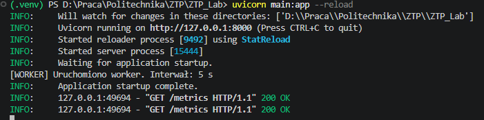
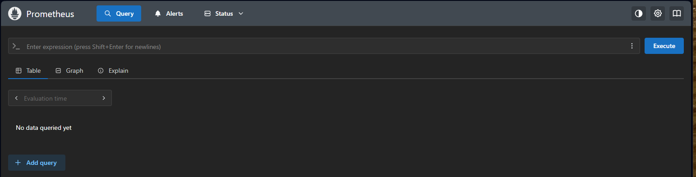
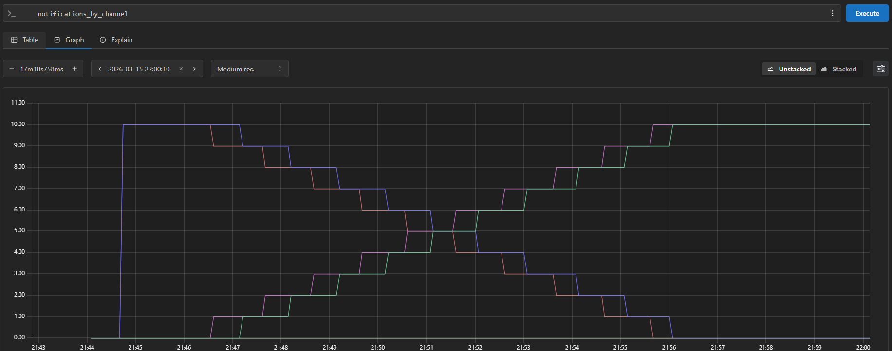
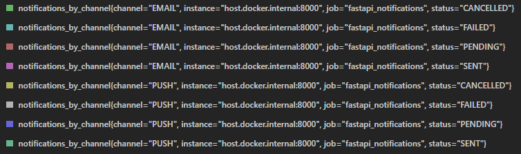

# Laboratorium 6

W poprzednich etapach projektu system został rozszerzony o możliwość planowania powiadomień oraz ich cyklicznej realizacji. W Laboratorium 4 wprowadzono model domenowy powiadomień, walidację danych wejściowych, obsługę stref czasowych oraz mechanizm maszyny stanów. Następnie, w Laboratorium 5, system został rozbudowany o warstwę wykonawczą odpowiedzialną za rzeczywistą realizację operacji, dispatcher wybierający kanał komunikacji oraz worker działający w tle aplikacji. Dzięki temu aplikacja przeszła od modelu biernego przechowywania rekordów do modelu aktywnego ich przetwarzania.

Celem Laboratorium 6 jest dalsze rozwinięcie systemu w kierunku zwiększenia jego niezawodności oraz zbliżenia go do rozwiązań stosowanych w rzeczywistych systemach backendowych. W szczególności wprowadzane są tu mechanizmy ograniczające ryzyko duplikacji operacji, umożliwiające kontrolę nad cyklem życia powiadomień oraz udostępniające podstawowe metryki działania systemu. Z perspektywy architektury oznacza to rozszerzenie dotychczasowego modułu notifications o nowe elementy warstwy modelu, logiki biznesowej, repozytorium i API, przy zachowaniu wcześniej przyjętego podziału na warstwy web, service, data oraz model.

## Idempotencja
W systemach sieciowych problem wielokrotnego wykonania tej samej operacji jest bardzo powszechne. Użytkownik może odświeżyć żądanie, klient może automatycznie ponowić połączenie po błędzie, a aplikacja może nie mieć pewności, czy poprzednia operacja zakończyła się sukcesem. Z tego względu niezbędne jest wprowadzenie mechanizmu pozwalającego rozpoznać, że dana operacja była już wcześniej przetwarzana.

Najprostszym i bardzo skutecznym rozwiązaniem jest dodanie do modelu pola idempotency_key. Pole to ma być unikalne dla każdego rekordu w bazie danych i jest generowane automatycznie po stronie serwera podczas tworzenia nowego rekordu.

```sql
-- app/db/init/002_notifications.sql
CREATE TABLE IF NOT EXISTS notifications (
    id INTEGER GENERATED BY DEFAULT AS IDENTITY PRIMARY KEY,
    content VARCHAR NOT NULL,
    channel VARCHAR NOT NULL,
    recipient VARCHAR NOT NULL,
    scheduled_at TIMESTAMP WITH TIME ZONE NOT NULL,
    timezone VARCHAR NOT NULL,
    status VARCHAR NOT NULL,
    created_at TIMESTAMP WITH TIME ZONE NOT NULL DEFAULT NOW(),
    idempotency_key VARCHAR UNIQUE NOT NULL
);
```
W warstwie modelu ORM pole jest odwzorowane jako kolumna wymagana i unikalna:
```python
class NotificationORM(Base):
    __tablename__ = "notifications"

    id: Mapped[int] = mapped_column(Integer, primary_key=True)
    content: Mapped[str] = mapped_column(String, nullable=False)
    channel: Mapped[str] = mapped_column(String, nullable=False)
    recipient: Mapped[str] = mapped_column(String, nullable=False)
    scheduled_at: Mapped[datetime] = mapped_column(DateTime(timezone=True), nullable=False)
    timezone: Mapped[str] = mapped_column(String, nullable=False)
    status: Mapped[str] = mapped_column(String, nullable=False)
    created_at: Mapped[datetime] = mapped_column(DateTime(timezone=True), nullable=False, default=lambda: datetime.now(timezone.utc))
    idempotency_key: Mapped[str] = mapped_column(String, nullable=False)
```
Ponieważ klucz jest generowany przez backend, nie powinien być elementem wejściowym modelu tworzenia rekordu. Model NotificationCreate zawiera wyłącznie dane biznesowe potrzebne do utworzenia powiadomienia, więc pozostaje on bez zmian.
```python
# app/notifications/model/notification_schema.py
class NotificationCreate(BaseModel):
    content: str = Field(..., min_length=1)
    channel: NotificationChannel
    recipient: str = Field(..., min_length=1)
    scheduled_at: datetime
    timezone: str = Field(..., min_length=1)
```
Jednocześnie klucz może być zwracany w odpowiedzi API, ponieważ stanowi techniczny identyfikator operacji i może być przydatny przy analizie logów, debugowaniu lub śledzeniu konkretnego rekordu:
```python
# app/notifications/model/notification_schema.py
class NotificationResponse(BaseModel):
    id: int
    content: str
    channel: NotificationChannel
    recipient: str
    scheduled_at: datetime
    timezone: str
    status: NotificationStatus
    created_at: datetime
    idempotency_key: str

    model_config = {
        "from_attributes": True
    }

```
Samo generowanie klucza odbywa się w warstwie service podczas tworzenia powiadomienia:
``` python
# app/notifications/service/notification_service.py
import secrets

def generate_idempotency_key() -> str:
    return f"notif_{secrets.token_urlsafe(24)}"
```
Następnie funkcja create_notification() wykorzystuje ten generator przy budowaniu nowego obiektu ORM:
```python
# app/notifications/service/notification_service.py

def create_notification(db: Session, notification_data: NotificationCreate) -> NotificationORM:
    validate_content(notification_data.content)
    validate_recipient(notification_data.recipient)
    validate_timezone(notification_data.timezone)
    validate_scheduled_at(notification_data.scheduled_at, notification_data.timezone)

    scheduled_at_utc = convert_to_utc(
        notification_data.scheduled_at,
        notification_data.timezone,
    )

    notification = NotificationORM(
        content=notification_data.content,
        channel=notification_data.channel.value,
        recipient=notification_data.recipient,
        scheduled_at=scheduled_at_utc,
        timezone=notification_data.timezone,
        status=NotificationStatus.PENDING.value,
        idempotency_key=generate_idempotency_key(), #uwzględnienie idempotencji
    )

    return add_notification(db, notification)
```
Takie rozwiązanie powoduje, że wielokrotne wysłanie tego samego żądania nie tworzy nowych rekordów, lecz zwraca już istniejący obiekt. Z punktu widzenia architektury systemu jest to ważny krok w kierunku niezawodności i odporności na błędy sieciowe. Dodatkowo nie ma możliwości deklarowania ani modyfikowania idempotency_key, natomiast system może nadal przechowywać i zwracać tę wartość jako element diagnostyczny oraz identyfikator techniczny rekordu.

## Metryki systemowe i integracja z Prometheus
Kolejnym elementem Laboratorium 6 jest warstwa obserwowalności systemu. W systemach produkcyjnych istotna jest możliwość śledzenia ich stanu, monitorowania liczby sukcesów i błędów oraz oceny bieżącego obciążenia. W tym celu dodajemy endpoint `/metrics`, który udostępnia metryki w formacie zrozumiałym dla Prometheusa.

Najpierw w repozytorium należy przygotować funkcję zliczającą rekordy według statusu:

```python
# app/notifications/data/notification_repository.py
def count_notifications_by_status(db: Session, status_value: str) -> int:
    return (
        db.query(NotificationORM)
        .filter(NotificationORM.status == status_value)
        .count()
    )
```
Aby umożliwić bardziej szczegółową obserwację systemu, warto także przygotować funkcję zliczającą rekordy jednocześnie według statusu i kanału komunikacji:
```python
# app/notifications/data/notification_repository.py
def count_notifications_by_status_and_channel(
    db: Session,
    status_value: str,
    channel_value: str,
    ) -> int:
    return (
        db.query(NotificationORM)
        .filter(NotificationORM.status == status_value)
        .filter(NotificationORM.channel == channel_value)
        .count()
    )
```


```python
# app/notifications/web/routes.py
from fastapi.responses import PlainTextResponse

@router.get(
    "/metrics",
    status_code=status.HTTP_200_OK,
)
def metrics_endpoint(db: Session = Depends(get_db)):
    sent = count_notifications_by_status(db, NotificationStatus.SENT.value)
    failed = count_notifications_by_status(db, NotificationStatus.FAILED.value)
    pending = count_notifications_by_status(db, NotificationStatus.PENDING.value)
    cancelled = count_notifications_by_status(db, NotificationStatus.CANCELLED.value)

    metrics_text = (
        "# HELP notifications_sent_total Number of sent notifications\n"
        "# TYPE notifications_sent_total gauge\n"
        f"notifications_sent_total {sent}\n"
        "# HELP notifications_failed_total Number of failed notifications\n"
        "# TYPE notifications_failed_total gauge\n"
        f"notifications_failed_total {failed}\n"
        "# HELP notifications_pending_total Number of pending notifications\n"
        "# TYPE notifications_pending_total gauge\n"
        f"notifications_pending_total {pending}\n"
        "# HELP notifications_cancelled_total Number of cancelled notifications\n"
        "# TYPE notifications_cancelled_total gauge\n"
        f"notifications_cancelled_total {cancelled}\n"
        "# HELP notifications_by_channel Number of notifications by status and channel\n"
        "# TYPE notifications_by_channel gauge\n"
    )

    for status_value in NotificationStatus:
        for channel_value in NotificationChannel:
            value = count_notifications_by_status_and_channel(
                db,
                status_value.value,
                channel_value.value,
            )
            metrics_text += (
                f'notifications_by_channel{{status="{status_value.value}",channel="{channel_value.value}"}} {value}\n'
            )

    return PlainTextResponse(metrics_text)
```
W przeciwieństwie do prostego formatu JSON, taki zapis jest zgodny z oczekiwaniami Prometheusa i może być bezpośrednio odczytywany przez ten system monitorujący.

## A czym właściwie jest Prometeus
Prometheus jest systemem służącym do monitorowania oraz zbierania metryk działania aplikacji i infrastruktury. Należy do klasy narzędzi określanych jako systemy obserwowalności (observability), których celem jest umożliwienie analizy zachowania systemu w czasie rzeczywistym oraz diagnozowania problemów.

Podstawowym zadaniem Prometheusa jest cykliczne pobieranie (scraping) danych metrycznych z aplikacji lub usług, które udostępniają specjalny endpoint, najczęściej pod ścieżką /metrics. Dane te są następnie przechowywane w wewnętrznej bazie czasowej (time series database), co pozwala analizować zmiany wartości metryk w czasie.

### Model działania

Prometheus działa w modelu typu pull, co oznacza, że to on inicjuje komunikację z aplikacją. W określonych odstępach czasu (np. co 5 sekund) wysyła zapytanie HTTP do endpointu metryk i pobiera aktualny stan systemu.




W kontekście projektu oznacza to, że:
1. aplikacja FastAPI udostępnia endpoint /metrics,
2. Prometheus cyklicznie odczytuje dane z tego endpointu, a wartości metryk są zapisywane i mogą być następnie analizowane w czasie.

Metryki są liczbową reprezentacją stanu systemu. Dzięki nim można obserwować, jak zmienia się liczba rekordów oczekujących, ile wiadomości zostało już wysłanych oraz jak rozkładają się one pomiędzy różne kanały komunikacji.

### Przykładowe metryki

- `notifications_sent_total` - liczba wysłanych powiadomień,
- `notifications_failed_total` - liczba nieudanych operacji,
- `notifications_pending_total` - liczba oczekujących powiadomień,
- `notifications_cancelled_total` - liczba anulowanych powiadomień.
- `notifications_by_channel{status="SENT",channel="EMAIL"}` - liczba poprawnie wysłanych wiadomości e-mail 
- `notifications_by_channel{status="SENT",channel="PUSH"}` – liczba poprawnie wysłanych wiadomości push

Takie podejście pozwala obserwować system nie tylko globalnie, ale również w podziale na kanały komunikacji.




### Konfiguracja Prometheusa
Dodanie elementu w  docker-compose.yml:
```yml
# docker-compose.yml
  prometheus:
    image: prom/prometheus
    container_name: prometheus_ztp
    volumes:
      - ./prometheus.yml:/etc/prometheus/prometheus.yml
    ports:
      - "9090:9090"
```
Plik prometheus.yml:
```yml
# .config/prometheus.yml
global:
  scrape_interval: 5s

scrape_configs:
  - job_name: "fastapi_notifications"
    static_configs:
      - targets: ["host.docker.internal:8000"]
```

Dostęp do Prometheusa będzie możliwy pod adresem:

http://localhost:9090

natomiast metryki aplikacji pozostaną dostępne pod endpointem:

http://localhost:8000/metrics

Jeżeli endpoint metryk został umieszczony pod innym prefiksem routera, należy odpowiednio zaktualizować konfigurację Prometheusa tak, aby wskazywała właściwą ścieżkę.

Dodanie Prometheusa nie zmienia logiki biznesowej systemu, ale znacząco poprawia jego obserwowalność i czyni projekt bardziej kompletnym z punktu widzenia praktyk inżynieryjnych.

## Zadania do wykonania na laboratorium
1. Aktywuj środowisko wirtualne 

    `python -m venv .venv`

    `.venv\Scripts\activate`

    Po aktywacji zainstaluj wymagane zależności:<br>
    `pip install -r .\requirements.txt`

2. Uruchom kontenery projektu za pomocą polecenia:<br>
    `docker compose up -d --build`


3. Uruchom aplikację poleceniem:<br>
    `uvicorn main:app --reload`


4. Dodaj parę rekordów powiadomień w niedalekim terminie,m aby móc sprawdzić działanie Prometheusa

5. Wejdź na stronę http://localhost:9090, a następnie wykonaj poniższe zapytania:
   - `notifications_pending_total`
   - `notifications_sent_total`
   - `notifications_cancelled_total`
   - `notifications_by_channel`
   - `notifications_by_channel{status="SENT"}`

6. Przełącz widok wyników pomiędzy zakładkami Table oraz Graph i porównaj sposób prezentacji danych.
7. Wykonaj operacje dodawania i anulowania powiadomienia i zaobserwuj zmiany po ponownym wykonaniu zapytań. 

## Projekt 2. Etap 2.
1. Rozszerzenie modelu danych o identyfikator operacji (`idempotency_key`)
2. Wprowadzenie mechanizmu monitorowania systemu (metryki). Dodanie endpointu `/metrics` zwracającego dane w formacie Prometheus
3. Integracja aplikacji z Prometheus
- Konfiguracja Prometheusa (docker-compose + prometheus.yml)
- Przygotowanie zestawu przykładowych danych (powiadomień) umożliwiających obserwację zmian w metrykach